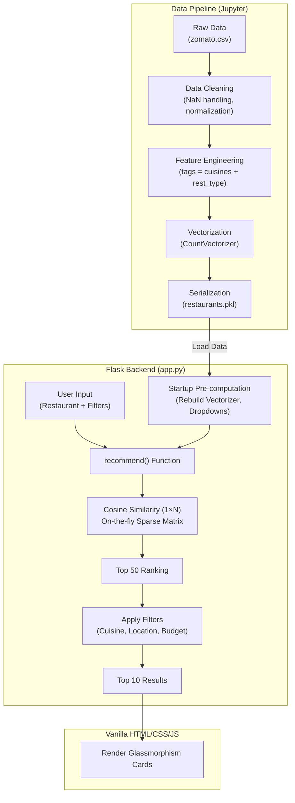

# <center>🍽️ Flavour Finder</center>

**<center>AI-Powered Restaurant Recommendation Engine</center>**

> A full-stack, content-based recommendation system for Bangalore restaurants, built with Python, Flask, and scikit-learn, featuring a custom premium dark UI.

## Overview

Flavour Finder solves the "what to eat next" problem by providing highly relevant, content-based restaurant recommendations. Using a Zomato dataset of approximately 50,000 Bangalore eateries, the system takes a user's favorite restaurant and returns the top 10 most similar options. The recommendations can be further refined by cuisine, locality, and budget. 

This project covers a complete end-to-end Machine Learning lifecycle: from raw CSV data processing, Exploratory Data Analysis (EDA), and feature engineering, to model vectorization, serialization, and finally, deployment via a Flask web application with a responsive, glassmorphism-styled frontend.

## Summary

* **Problem Solved:** Finding similar restaurants based on cuisine and establishment type across a massive dataset of 50K+ entries.
* **Technical Approach:** Content-based filtering using Natural Language Processing (NLP) bag-of-words techniques and cosine similarity.
* **Architecture:** Flask backend serving a custom-built Vanilla JS/CSS frontend, with an on-the-fly similarity computation engine to optimize memory.
* **Important Technologies:** Python, scikit-learn, Pandas, NumPy, Flask, HTML5/CSS3/JS.
* **Skills Demonstrated:** NLP feature engineering, memory-aware model deployment, full-stack web development without frameworks, data pipeline construction.
* **Current Status:** Fully functional local prototype.

## Key Features

* **Content-Based Filtering:** Uses cosine similarity over a `CountVectorizer` bag-of-words representation of engineered cuisine and restaurant-type tags.
* **Memory-Efficient Inference:** Computes a per-request `1×N` sparse cosine similarity vector instead of loading a precomputed 4.2 GB matrix into memory.
* **Multi-Level Post-Filtering:** Refines algorithmic recommendations by cuisine, locality, and budget brackets (₹0 – ₹3000+).
* **Custom Searchable Dropdown:** A bespoke JavaScript widget filters 50,000+ restaurant names entirely client-side without API round-trips.
* **JSON Autocomplete API:** A REST endpoint (`GET /api/restaurants?q=`) that returns matching names.
* **Premium UI/UX:** A responsive dark-themed interface featuring glassmorphism, animated carousels, and scroll-reveals built entirely with Vanilla CSS and JS.

## Architecture 



## Tech Stack

* **Programming Language:** Python 3.10+
* **Machine Learning / NLP:** scikit-learn 1.4.2 (`CountVectorizer`, `cosine_similarity`)
* **Data Processing:** Pandas 2.2.2, NumPy 1.26.4
* **Exploratory Data Analysis:** Matplotlib 3.8.4, Seaborn 0.13.2
* **Backend Framework:** Flask 3.0.3 (Jinja2 templating)
* **Frontend:** HTML5, Vanilla CSS (968 lines), Vanilla JS (266 lines)
* **Serialization:** pickle

## Project Structure

```text
flavour-finder-ai/
├── .git/
├── .venv/
├── data/
│   └── zomato.csv
├── models/
│   ├── restaurants.pkl
│   └── similarity.pkl
├── notebooks/
│   ├── eda.ipynb
│   └── model.ipynb
├── screenshots/
│   ├── Home-page.png
│   ├── Prediction-outcome.png
│   ├── Prediction-page.png
│   └── Project-description.png
├── static/
│   ├── css/
│   │   └── main.css
│   ├── images/
│   │   ├── food.gif
│   │   ├── food.png
│   │   ├── food_burger.png
│   │   ├── food_curry.png
│   │   ├── food_dessert.png
│   │   ├── food_dimsum.png
│   │   └── food_pizza.png
│   └── js/
│       └── main.js
├── templates/
│   ├── index.html
│   └── web.html
├── visuals/
│   ├── cuisine_freq.png
│   ├── rating_distribution.png
│   ├── top_rated.png
│   └── top_restaurants.png
├── .gitignore
├── README.md
├── app.py
├── models.zip
├── project_summary.md
└── requirements.txt
```

- `data/` — Contains the raw project dataset (`zomato.csv`).
- `models/` — Serialized data (`restaurants.pkl`) and precomputed similarity matrix for the application.
- `notebooks/` — Jupyter notebooks for data cleaning, EDA, and feature engineering.
- `screenshots/` — Images showcasing the web application interface and user flow.
- `static/` — Frontend assets including custom CSS, images, and JavaScript logic.
- `templates/` — HTML Jinja2 templates for the Flask application.
- `visuals/` — Charts and graphs generated during Exploratory Data Analysis.
- `app.py` — Core Flask server, routing, and recommendation logic.
- `models.zip` — Compressed archive of the large precomputed model files.
- `project_summary.md` — Detailed summary and overview of the project.
- `requirements.txt` — Python dependencies needed to run the application.

## Core Workflow

1. **Input:** The user selects a restaurant they like from a searchable dropdown and optionally sets cuisine, location, and budget filters.
2. **Processing:** The Flask server looks up the index of the selected restaurant.
3. **Algorithmic Logic:** `app.py` calculates a `1×N` cosine similarity between the selected restaurant's feature vector and the entire dataset's sparse matrix.
4. **Transformation:** The system identifies the top 50 most similar restaurants, then iteratively applies the user's filters (cuisine string matching, location exact match, budget range check).
5. **Output:** The filtered top 10 results are passed to the Jinja2 template and rendered as stylized cards.

## Implementation Details

* **Feature Engineering:** The recommendation signal relies on concatenating the `cuisines` and `rest_type` columns into a single lowercase `tags` string (e.g., "north indian, chinese casual dining").
* **State Management:** Filter data (unique cuisines, locations, budget brackets) is computed precisely once at application startup to avoid redundant Pandas `unique()` operations during web requests.
* **Graceful Degradation:** By fetching the top 50 algorithmic matches before applying strict heuristic filters, the system ensures a robust top 10 is still returned even when narrow budget or location constraints are applied.

## Algorithms & Models

* **CountVectorizer:** Translates the text-based `tags` feature into a numerical bag-of-words matrix, with a ceiling of 5,000 features to control dimensionality. Stop-words are filtered out to remove noise. Term frequency weighting (TF-IDF) was deliberately avoided as tags are categorical labels rather than prose.
* **Cosine Similarity:** Measures the cosine of the angle between two multi-dimensional vectors. In this context, it calculates the distance between the reference restaurant's feature vector and all other restaurant vectors, assigning a score from 0 (completely dissimilar) to 1 (identical features).

## Exploratory Data Analysis (EDA)

The `notebooks/eda.ipynb` notebook provides insights into the Bangalore food landscape:
* **Cuisine Dominance:** North Indian cuisine is the most prevalent (~21,000 listings), followed by Chinese (~15,500) and South Indian.
* **Rating Distribution:** Restaurant ratings follow a normal distribution centered around 3.7/5.0, with very few establishments scoring below 2.5 or above 4.8.
* **Chain Presence:** Cafe Coffee Day operates the highest number of outlets (96), followed closely by Onesta and Just Bake.

## Data Source

**Dataset:** [Zomato Bangalore Restaurants](https://www.kaggle.com/datasets/himanshupoddar/zomato-bangalore-restaurants)

**Source:** [Kaggle](https://www.kaggle.com/datasets/himanshupoddar/zomato-bangalore-restaurants)

**License:** Data files © Original Authors

**Usage:** Provides the restaurant listing data, including cuisines and establishment types, used to generate the content-based recommendations.

* **Size:** ~574 MB raw CSV, ~50,000 listings.
* **Features Used:** `name`, `cuisines`, `rate` (normalized to float), `approx_cost` (normalized to float), `rest_type`, `location`.
* **Storage Approach:** The cleaned, essential data is serialized into a 3.9 MB `restaurants.pkl` file, acting as an in-memory database for the Flask application.

## Security & Validation

* **Input Validation:** The backend performs explicit type checking on budget boundaries and location existence before querying the dataset.
* **Client-Side Restrictions:** The frontend prevents empty form submissions and flashes visual error states to guide correct user behavior.

## Performance / Optimization

* **Memory Optimization (Crucial):** The initial Jupyter notebook computes an $N \times N$ similarity matrix resulting in a 4.2 GB `.pkl` file. Loading this into a Flask web worker is highly inefficient. Instead, `app.py` loads only the 3.9 MB DataFrame, reconstructs the `CountVectorizer` sparse matrix at startup, and performs a rapid `1×N` similarity calculation dynamically per request.
* **Client-Side Processing:** The searchable restaurant dropdown handles filtering 50K options entirely via JavaScript, minimizing server load and eliminating network latency for UI interactions.

## Challenges & Engineering Decisions

* **Challenge:** Displaying 50,000+ restaurant names in a standard HTML `<select>` element caused severe browser lag and unresponsiveness.
* **Decision:** Built a custom Vanilla JS searchable input component.
* **Trade-off:** Requires more complex client-side state management but guarantees a smooth, 60fps user experience without requiring pagination API endpoints.

* **Challenge:** Balancing recommendation accuracy with real-world usability.
* **Decision:** Implemented a two-stage approach: strict algorithmic similarity first (top 50), followed by heuristic filtering (cuisine/location/budget).
* **Solution:** Ensures that a user asking for "budget Chinese like Restaurant X" gets the most similar matches *that actually fit their wallet*, rather than highly similar but expensive restaurants.

## Testing

* **Status:** No formal automated testing suite currently exists.
* **Validation:** All components (data processing, model inference, web application, and API) have been manually verified, with edge cases (like missing tags and extreme budget limits) handled via server-side fallbacks.

## Future Improvements

* **Hybrid Recommendation Engine:** Integrate user rating signals to combine collaborative filtering with the existing content-based approach.
* **Production Deployment:** Containerize the application via Docker and deploy using a production WSGI server (e.g., Gunicorn) behind Nginx.
* **Automated Test Suite:** Implement `pytest` coverage for the core `recommend()` function and Flask routes.
* **Geolocation:** Incorporate geospatial data to prioritize recommendations geographically close to the user.

## How to Run

```bash
# 1. Clone the repository
git clone https://github.com/eldrich-victoria/flavour-finder-ai.git
cd flavour-finder-ai

# 2. Setup virtual environment
python -m venv .venv
# Windows: .venv\Scripts\activate
# Unix: source .venv/bin/activate

# 3. Install dependencies
pip install -r requirements.txt

# 4. Generate the models (Ensure data/zomato.csv is present)
# Run all cells in notebooks/model.ipynb to generate models/restaurants.pkl

# 5. Start the Flask server
python app.py
# Access at http://127.0.0.1:5000
```


Then open your browser and visit: **http://127.0.0.1:5000/**

## 📖 Usage

1. **Home page** → Browse the landing page with the food carousel and learn how the system works
2. **Recommend page** → Click "Get Recommendations" or navigate to `/recommend`
3. **Search** → Type at least 2 characters in the restaurant search box to filter the dropdown
4. **Filter** → Optionally narrow results by cuisine, Bangalore locality, or budget bracket
5. **Submit** → Click "Get Recommendations" to view the top 10 similar restaurants as styled cards
6. **Review** → Each card shows the restaurant name, cuisine tags, rating (color-coded), cost for two, and location

## 📋 Recommendation Output

Each recommendation card displays:

| Field | Description |
|-------|-------------|
| **Name** | Restaurant name |
| **Cuisines** | Up to 4 cuisine tags as pill badges |
| **Rating** | Mean rating out of 5.0 (green ≥ 3.8, amber ≥ 3.0, red < 3.0) |
| **Cost** | Approximate cost for two (₹) |
| **Location** | Bangalore locality |

## 🎨 Frontend Design

The UI features a premium dark-mode design system:

- **Color palette** — Deep black base (#0a0a0f) with amber/gold accents (#f59e0b)
- **Typography** — Playfair Display for headings, Inter for body text
- **Effects** — Glassmorphism panels, backdrop blur, glow shadows, gradient accents
- **Animations** — `fadeInUp` entrance animations, staggered card reveals, carousel crossfade, scroll-triggered step cards
- **Responsiveness** — Three breakpoints (1024px, 768px, 480px) for full device coverage

## 🔮 Future Scope

- Hybrid recommendation model combining content-based and collaborative filtering
- User accounts with personalized recommendation history
- Location-aware recommendations using geolocation
- REST API layer for mobile app integration
- Deployment to a cloud platform (AWS, GCP, or Heroku)
- Docker containerization for portable deployment
- Unit and integration tests for recommendation logic and routes

## 🤝 Contributing

Contributions are welcome! To contribute:

1. Fork the repository
2. Create a feature branch (`git checkout -b feature/your-feature`)
3. Commit your changes (`git commit -m "Add your feature"`)
4. Push to the branch (`git push origin feature/your-feature`)
5. Open a Pull Request

## 👤 Author

**Eldrich Domnick Victoria**
