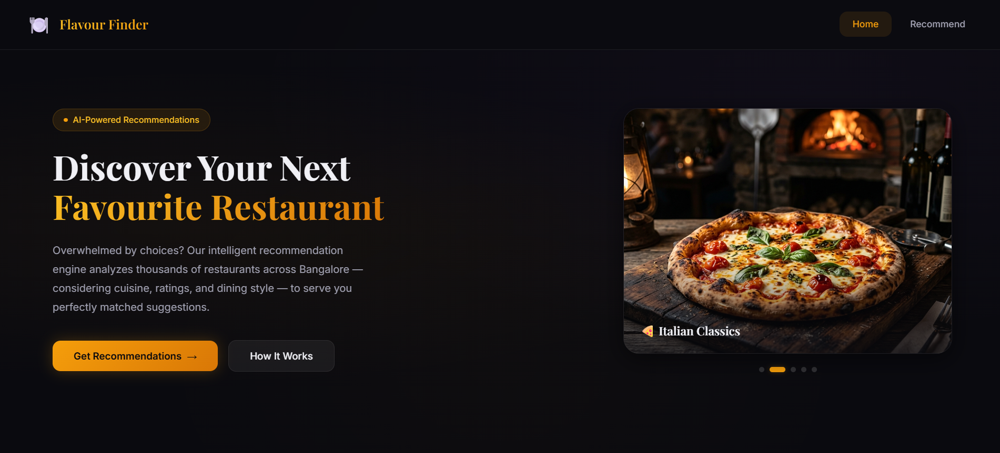
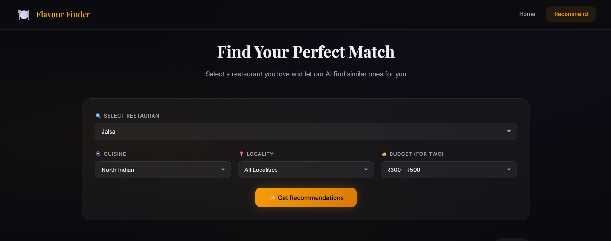
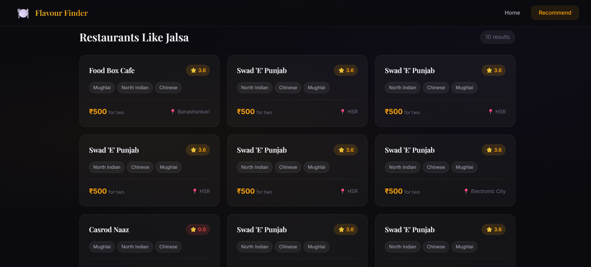
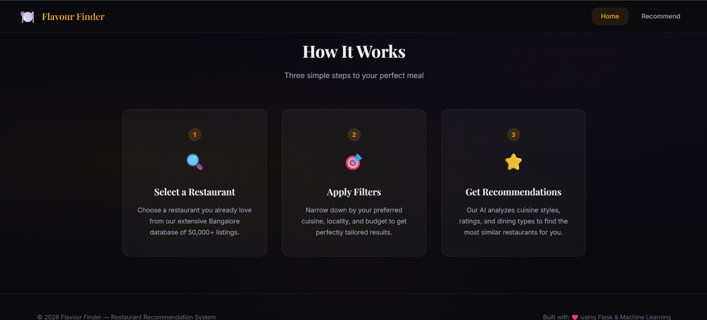
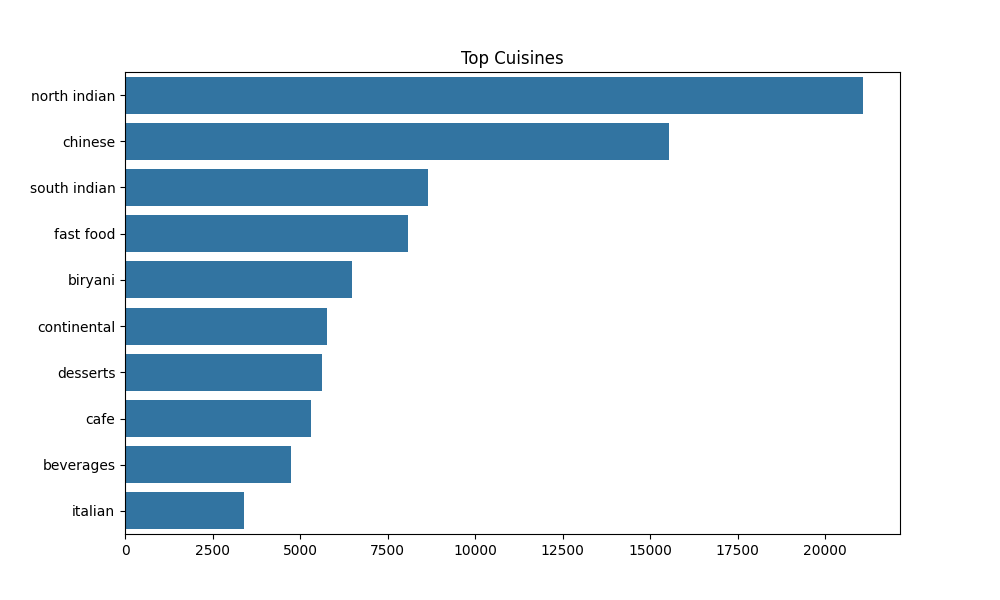
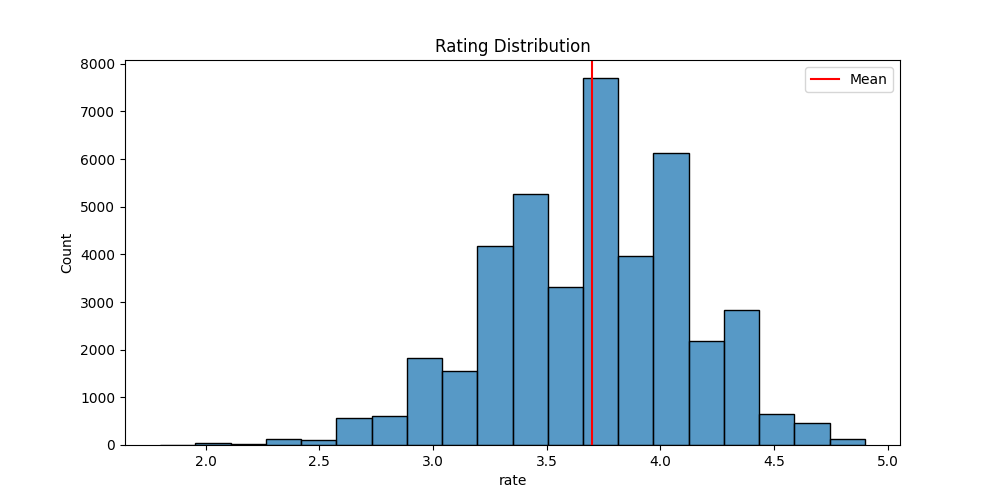
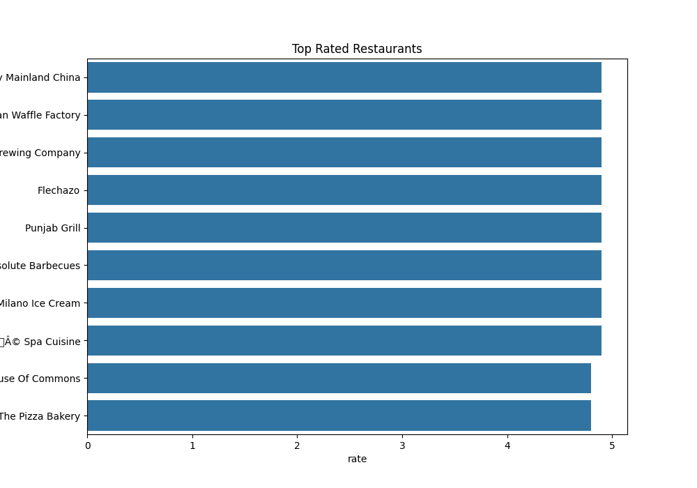
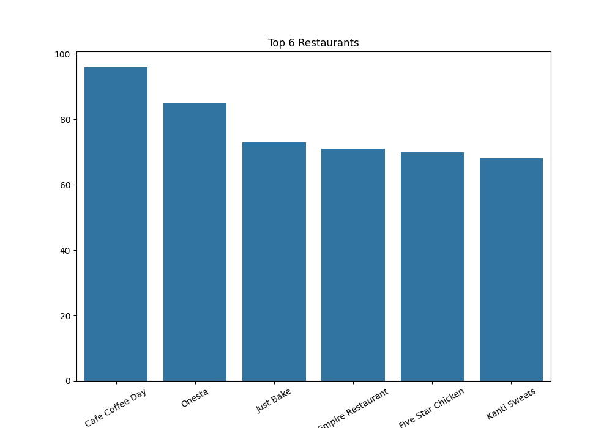

# Flavour Finder

A content-based restaurant recommendation system for Bangalore that recommends restaurants based on cuisine and restaurant type, with additional filtering by locality and budget.

## The Problem

Finding a restaurant in Bangalore can become a choice-overload problem. With more than 50,000 restaurant listings, simply browsing available options does not provide a practical way to narrow down restaurants that are similar to one a user already likes.

Flavour Finder was built to turn that search into a recommendation problem: start with a restaurant the user already knows and return the most similar alternatives based on their cuisine and restaurant type.

## The Problem I Faced

The initial approach of precomputing the complete restaurant-to-restaurant similarity matrix created a significant deployment problem.

For approximately 51,717 restaurants, an $N \times N$ similarity matrix required around **4.2 GB of storage/memory**. Loading that matrix into a web application would create substantial RAM overhead, particularly when multiple web worker processes are involved.

There was also a separate frontend problem. Putting more than 50,000 restaurant names directly into a standard HTML `<select>` caused the browser to become slow and freeze during rendering.

The project therefore evolved around two practical constraints:

* Avoid loading a multi-gigabyte similarity matrix during web inference.
* Allow users to search through 50,000+ restaurant names without rendering thousands of DOM options.

## Architecture

The system uses a content-based filtering approach rather than collaborative filtering. It does not require user-rating histories or a trained supervised prediction model.

```text
[Zomato Bangalore Dataset]
            |
            v
[Data Cleaning & Feature Engineering]
            |
            | cuisines + rest_type
            v
          [tags]
            |
            v
   [CountVectorizer]
            |
            v
[Sparse Restaurant Feature Matrix]
            |
            v
     [Flask Application]
            |
            | User selects restaurant
            v
 [Restaurant Index Lookup]
            |
            v
 [1 x N Cosine Similarity]
            |
            v
 [Top 50 Similar Candidates]
            |
            v
[Cuisine / Locality / Budget Filters]
            |
            v
 [Top 10 Recommendations]
            |
            v
   [Recommendation UI]
```

The processed dataset is stored in `models/restaurants.pkl`. When Flask starts, the application loads this DataFrame and fits a `CountVectorizer` with up to 5,000 features and English stop-word removal.

For each recommendation request, the application calculates cosine similarity between the selected restaurant's vector and the complete sparse feature matrix. Instead of loading the old $N \times N$ similarity matrix, it calculates only the required **$1 \times N$ similarity vector**.

The application then takes the top 50 algorithmic candidates and applies the user's optional constraints:

1. Cuisine substring matching
2. Locality matching
3. Budget range filtering

The final result contains up to 10 restaurants.

## Design Decisions

### CountVectorizer Instead of TF-IDF

The recommendation features are primarily categorical restaurant attributes: cuisines and restaurant types.

The engineered `tags` field combines these values into a single text representation, for example:

```text
north indian, mughlai, chinese casual dining
```

`CountVectorizer` was used rather than `TfidfVectorizer` because the frequency of a cuisine token is not the same type of signal as word frequency in a conventional document corpus. Common cuisine categories such as `North Indian` are still useful recommendation signals and should not automatically be down-weighted because they occur frequently.

### On-the-Fly Similarity Instead of a Precomputed Matrix

The original full similarity matrix required approximately **4.2 GB**, while the runtime application only needs to compare one selected restaurant against all restaurants.

The final approach therefore rebuilds the sparse feature matrix at application startup and computes:

```text
1 x N cosine similarity
```

for each request.

The project reports that this reduces the memory requirement from approximately **4.2 GB to ~20 MB** for the similarity computation while keeping inference latency **under 10 ms**.

This was a deployment-oriented decision rather than an attempt to make the recommendation algorithm more sophisticated.

### Two-Stage Retrieval and Filtering

Instead of applying all filters before calculating similarity, the system first retrieves the top 50 algorithmically similar restaurants.

It then applies the user's cuisine, locality, and budget constraints to those candidates.

This keeps the recommendation signal tied to the selected restaurant while still allowing users to impose practical constraints on the results.

One consequence of this design is that a restaurant satisfying every filter may still not appear if it falls outside the initial top 50 candidates.

### Custom Restaurant Search

A standard HTML `<select>` containing more than 50,000 options created browser rendering problems.

The project instead uses a custom Vanilla JavaScript searchable input. Queries of at least two characters are filtered client-side, with the interface displaying the top 30 matches.

This avoids API round-trips for normal restaurant-name searches while preventing the browser from having to render the entire dataset as `<option>` elements.

## Technical Approach

### Data Cleaning

The raw Zomato dataset is cleaned before being used by the recommendation system:

* Missing `cuisines` and `rest_type` values are replaced with empty strings.
* Missing ratings are replaced with `0`.
* Commas are removed from `cost`.
* `/5` is removed from rating values before numerical conversion.
* A `tags` field is created by combining `cuisines` and `rest_type`.

### Feature Engineering

The recommendation signal is represented by the `tags` field:

```text
tags = cuisines + rest_type
```

This creates a textual representation of each restaurant's cuisine and establishment type.

### Vectorization

`CountVectorizer` converts the `tags` field into a sparse bag-of-words matrix.

Configuration:

```text
max_features = 5000
stop_words = "english"
```

The resulting matrix contains **51,717 restaurant vectors**.

### Similarity Calculation

For a selected restaurant, the application calculates cosine similarity between its vector and all restaurant vectors:

```text
Selected Restaurant Vector
          |
          v
    Cosine Similarity
          |
          v
    1 x 51,717 Scores
```

The similarity scores are sorted to identify the top candidates.

### Post-Filtering

The first 50 similarity candidates are then filtered according to user-selected criteria:

* Cuisine
* Location
* Cost

The remaining candidates are used to produce the top 10 recommendations.

## Dataset

The system uses the **Zomato Bangalore Restaurants Dataset**, sourced from Kaggle and attributed to Himanshu Poddar.

### Raw Dataset

* **Rows:** 51,717
* **Columns:** 17
* **Size:** approximately 574 MB
* **Format:** CSV
* **Path:** `data/zomato.csv`

### Processed Dataset

* **Rows:** 51,717
* **Columns:** 6
* **Size:** approximately 3.96 MB
* **Format:** serialized pandas DataFrame
* **Path:** `models/restaurants.pkl`

The processed dataset contains:

```text
name
cuisines
Mean Rating
cost
tags
location
```

## Results

The project does not contain formal recommender-system benchmark metrics such as Precision@K, Recall@K, MAP, or NDCG. These metrics are therefore not claimed as evaluation results.

The main measured engineering result was the change in similarity computation strategy:

| Approach               | Similarity Representation                 | Reported Memory |
| ---------------------- | ----------------------------------------- | --------------: |
| Precomputed approach   | Full $N \times N$ matrix                  |         ~4.2 GB |
| Final runtime approach | On-the-fly $1 \times N$ sparse similarity |          ~20 MB |

The project reports **sub-10 ms** similarity computation latency for the on-the-fly approach.

This corresponds to approximately a **99.9% reduction in memory usage** compared with the full similarity matrix.

## Exploratory Data Analysis

The EDA notebook analyzes restaurant distribution across cuisines, ratings, and restaurant chains.

The generated analyses show:

* North Indian is the most frequent cuisine category at approximately 21,000 listings.
* Chinese appears in approximately 15,500 listings.
* South Indian appears in approximately 8,500 listings.
* Ratings are approximately normally distributed around 3.7 / 5.
* Cafe Coffee Day has the highest number of listed outlets at 96, followed by Onesta with 85 and Just Bake with 73.

The EDA outputs are stored in the `visuals/` directory.

## Application Features

### Content-Based Recommendations

Recommendations are generated from the similarity between restaurant feature vectors created from cuisine and restaurant-type information.

### Multi-Level Filtering

Users can refine recommendations using:

* Cuisine
* Locality
* Budget

### Restaurant Search

A custom Vanilla JavaScript search component allows users to search through 50,000+ restaurant names without rendering the complete list as a standard HTML dropdown.

### REST Autocomplete API

The Flask application provides:

```text
GET /api/restaurants?q=
```

which returns matching restaurant names as JSON.

### Web Interface

The frontend uses:

* Vanilla HTML5
* Vanilla CSS3
* Vanilla JavaScript
* Jinja2 templates

The interface includes a dark glassmorphism design, Playfair Display and Inter fonts, an auto-rotating food-image carousel, scroll-reveal animations using `IntersectionObserver`, and rating-based color coding.

## Limitations

### Limited Recommendation Signal

Recommendations rely on `cuisines` and `rest_type`.

The system does not consider:

* Text reviews
* Individual user preferences
* User rating histories
* Physical distance

As a result, restaurants can be considered similar because they share categorical tags even when other aspects of the dining experience differ.

### Strict Multi-Filtering

Filtering is performed after retrieving only the top 50 similarity candidates.

A combination of a rare cuisine, restrictive locality, and narrow budget can therefore produce zero recommendations even when suitable restaurants exist elsewhere in the dataset.

### Exact Restaurant Lookup

The recommendation endpoint expects a valid restaurant name from the available index. A manually submitted name that does not match the index fails the lookup.

### Legacy Similarity Artifact

`models/similarity.pkl` is approximately 4.2 GB and is generated by the model notebook, but it is **not used by the Flask application**. The runtime system uses the on-the-fly similarity approach instead.

### Testing

The project does not currently contain an automated unit or integration test suite.

### Deployment

There is no production WSGI or Docker deployment configuration. The current application also runs with Flask's `debug=True` setting enabled.

## What I Learned

The main lesson from this project was that an ML system that works mathematically is not necessarily an ML system that works well as an application.

The full similarity matrix was a straightforward way to obtain recommendations, but its memory requirements made it poorly suited to a web-serving environment. Reframing the inference operation as a single-query-to-all-items similarity calculation produced a much smaller runtime footprint without changing the underlying recommendation principle.

The frontend presented a similar engineering constraint. A dataset can be manageable from a data-processing perspective while still becoming problematic when directly represented in a browser DOM. Replacing a 50,000-option HTML control with client-side searchable behavior made the interaction practical without requiring a request to the backend for every search.

The project also highlighted the trade-off introduced by staged retrieval: restricting filtering to the top 50 candidates improves the relationship between recommendations and the selected restaurant, but can prevent heavily constrained searches from finding otherwise valid results.

## Screenshots

### Home Page



### Recommendation Page



### Recommendation Results



### Project Description



## EDA Visualizations

### Cuisine Frequency



### Rating Distribution



### Top Rated Restaurants



### Most Listed Restaurants



## Installation

Python 3.10+ is required. The project was tested with Python 3.11.9.

Create a virtual environment:

```bash
python -m venv .venv
```

Activate it on Windows:

```bash
.venv\Scripts\activate
```

Or on Unix/macOS:

```bash
source .venv/bin/activate
```

Install the dependencies:

```bash
pip install -r requirements.txt
```

## Running the Application

The processed `models/restaurants.pkl` file is already available, so model generation is optional.

To regenerate the processed data, run all cells in:

```text
notebooks/model.ipynb
```

Then start the Flask application:

```bash
python app.py
```

Open the application at:

```text
http://127.0.0.1:5000/
```

## Project Structure

```text
flavour-finder/
├── app.py
├── requirements.txt
├── README.md
├── project_summary.md
├── .gitignore
│
├── data/
│   └── zomato.csv
│
├── models/
│   ├── restaurants.pkl
│   └── similarity.pkl
│
├── notebooks/
│   ├── eda.ipynb
│   └── model.ipynb
│
├── static/
│   ├── css/
│   │   └── main.css
│   ├── js/
│   │   └── main.js
│   └── images/
│
├── templates/
│   ├── index.html
│   └── web.html
│
├── screenshots/
└── visuals/
```

## Technology Stack

| Area                   | Technology                       |
| ---------------------- | -------------------------------- |
| Language               | Python 3.11                      |
| Backend                | Flask 3.0.3                      |
| Machine Learning / NLP | scikit-learn 1.4.2               |
| Vectorization          | CountVectorizer                  |
| Similarity             | Cosine Similarity                |
| Data Processing        | pandas 2.2.2, NumPy 1.26.4       |
| Visualization          | Matplotlib 3.8.4, Seaborn 0.13.2 |
| Frontend               | HTML5, CSS3, Vanilla JavaScript  |
| Templates              | Jinja2                           |
| Serialization          | pickle                           |

## Development History

The project evolved through several iterations:

```text
1eb278c  Initial commit — Restaurant Recommendation System base
    |
0f2bdab  UI & Core Update — Enhanced UI, app logic, visuals and EDA
    |
23a8bfe  Cleanup — Removed temporary implementation plan
    |
86f9067  Refinement — Updated README and .gitignore
    |
304f56d  Documentation — Updated README with project details
    |
ffb5ef9  Artifacts — Added models, screenshots and project summary
    |
c1bd2c8  Final Touch — Updated README documentation
```

## Future Improvements

The current implementation leaves several areas open for further development:

* Introduce quantitative recommender evaluation such as Precision@K, Recall@K, MAP, or NDCG.
* Add automated unit and integration tests.
* Improve the recommendation signal beyond cuisine and restaurant type.
* Incorporate reviews, user preferences, or distance into recommendations.
* Reconsider the top-50 retrieval constraint for heavily filtered searches.
* Remove or replace the unused legacy similarity artifact.
* Add a production WSGI deployment configuration.
* Add containerized deployment support.
