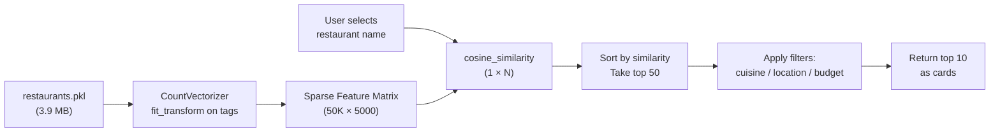
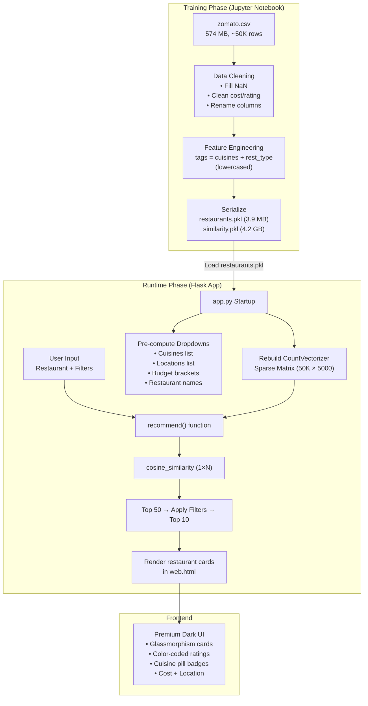

# 🍽️ Flavour Finder — Complete Project Analysis

> A full-stack, AI-powered restaurant recommendation system built on the Zomato Bangalore dataset.

---

## 1. Project Purpose & Goal

**Flavour Finder** is a content-based restaurant recommendation system. Given a restaurant the user already likes, it finds the **top 10 most similar restaurants** from a database of ~50,000 Bangalore listings — optionally filtered by cuisine, locality, and budget.

The project covers the complete ML lifecycle:

| Phase | What happens |
|-------|-------------|
| **Data Collection** | Zomato Bangalore dataset (~574 MB CSV, ~50K rows) |
| **EDA** | Exploratory analysis with Matplotlib/Seaborn visualizations |
| **Feature Engineering** | Combine `cuisines` + `rest_type` into a single `tags` text column |
| **Model Building** | CountVectorizer (bag-of-words) → Cosine Similarity |
| **Deployment** | Flask web application with a premium dark-themed UI |

---

## 2. Project Structure — File-by-File Breakdown

```text
restaurant-recommender-system/          # Root
├── app.py                              # Flask server (185 lines) — THE core runtime
├── requirements.txt                    # Python dependencies (11 lines)
├── README.md                           # Documentation (195 lines)
├── .gitignore                          # Excludes .venv, data/, *.pkl, etc.
│
├── data/
│   └── zomato.csv                      # Raw Zomato dataset (574 MB, ~50K restaurants)
│
├── models/
│   ├── restaurants.pkl                 # Cleaned DataFrame (3.9 MB) — USED at runtime
│   └── similarity.pkl                  # Full similarity matrix (4.2 GB) — LEGACY, NOT used
│
├── notebooks/
│   ├── eda.ipynb                       # EDA notebook with charts (137 KB)
│   └── model.ipynb                     # Data cleaning + model training (6.7 KB)
│
├── static/
│   ├── css/main.css                    # Design system (968 lines, ~20 KB)
│   ├── js/main.js                      # Client-side logic (266 lines, ~9 KB)
│   └── images/                         # 7 food images for carousel + UI
│       ├── food_curry.png, food_pizza.png, food_dimsum.png
│       ├── food_burger.png, food_dessert.png
│       ├── food.gif, food.png
│
├── templates/
│   ├── index.html                      # Landing page with hero + carousel (143 lines)
│   └── web.html                        # Recommendation form + results page (164 lines)
│
└── visuals/                            # EDA output charts (4 PNGs)
    ├── cuisine_freq.png
    ├── rating_distribution.png
    ├── top_rated.png
    └── top_restaurants.png
```

---

## 3. Data Pipeline — Start to End

### Phase 1: Raw Data (`data/zomato.csv`)

The source is the **Zomato Bangalore Restaurants** dataset (574 MB). Key columns:

| Column | Description |
|--------|-------------|
| `name` | Restaurant name |
| `cuisines` | Comma-separated cuisine types |
| `rate` | Rating string (e.g., `"4.1/5"`) |
| `approx_cost(for two people)` | Cost in ₹ (string, may have commas) |
| `rest_type` | Restaurant type (e.g., "Casual Dining", "Quick Bites") |
| `location` | Bangalore locality |

### Phase 2: Data Cleaning & Feature Engineering (`notebooks/model.ipynb`)

The model notebook runs these exact steps:

1. **Load CSV** → Select 5 columns: `name`, `cuisines`, `rate`, `cost`, `rest_type`
2. **Rename** → `rate` → `Mean Rating`, `approx_cost(for two people)` → `cost`
3. **Clean missing values** → Fill `cuisines`/`rest_type` with empty string, `Mean Rating` with 0
4. **Clean cost** → Remove commas, convert to float
5. **Clean rating** → Remove `/5` suffix, convert to float
6. **Feature engineering** → Create `tags = cuisines + " " + rest_type`, lowercased
7. **Build final DataFrame** → columns: `name`, `cuisines`, `Mean Rating`, `cost`, `tags`
8. **Vectorize** → `CountVectorizer(max_features=5000, stop_words='english')` on `tags`
9. **Compute similarity** → Full `cosine_similarity(vectors)` matrix
10. **Serialize** → Save to `restaurants.pkl` and `similarity.pkl`

> [!IMPORTANT]
> The notebook also generates `similarity.pkl` (4.2 GB), but the Flask app **does NOT load it**. The app recomputes similarity on-the-fly for only the selected restaurant, which is far more memory-efficient.

### Phase 3: Runtime Recommendation (`app.py`)



At startup, `app.py`:
1. Loads `restaurants.pkl`
2. Rebuilds the CountVectorizer + sparse matrix in memory
3. Pre-computes all filter dropdown data (unique cuisines, locations, budget brackets)
4. Creates an index mapping of restaurant names → DataFrame indices

On each request:
1. Computes cosine similarity **only** for the selected restaurant (1×N vector operation)
2. Takes the top 50 most similar results
3. Applies optional filters (cuisine, location, budget range)
4. Returns top 10 after filtering

---

## 4. Flask Backend Architecture

### Routes

| Route | Method | Purpose |
|-------|--------|---------|
| `/` | GET | Landing page (hero section + food carousel + "How It Works") |
| `/recommend` | GET | Empty recommendation form with dropdowns |
| `/recommend` | POST | Process form → run recommendation → render result cards |
| `/api/restaurants` | GET | JSON autocomplete API (`?q=` param, min 2 chars, returns top 20) |

### Key Design Decisions

- **On-the-fly similarity** — Instead of loading the 4.2 GB precomputed matrix, the app computes similarity per-request. This trades a tiny amount of latency for massive memory savings.
- **Budget brackets** — 6 predefined price ranges (Under ₹300 to Above ₹3000) instead of free-form input.
- **Pre-computed dropdown data** — All unique cuisines, locations, and restaurant names are computed once at startup and passed to every template render.
- **Client + server validation** — The form validates on the frontend (JS) and also handles empty/invalid input on the server (Flask).

---

## 5. Frontend Architecture

### Pages

| Page | File | Description |
|------|------|-------------|
| **Landing** | `templates/index.html` | Hero section with text + food image carousel + "How It Works" 3-step cards + footer |
| **Recommend** | `templates/web.html` | Searchable restaurant dropdown + 3 filter dropdowns + submit button + result cards grid + error states |

### Design System (`static/css/main.css` — 968 lines)

| Aspect | Implementation |
|--------|---------------|
| **Theme** | Dark mode: `#0a0a0f` base with amber/gold `#f59e0b` accents |
| **Typography** | Playfair Display (headings), Inter (body) via Google Fonts |
| **Effects** | Glassmorphism, backdrop blur, glow shadows, gradient accents, animated background grain |
| **Components** | Navbar, hero, buttons, carousel, step cards, search panel, form selects, restaurant cards, error states, footer |
| **Animations** | `fadeInUp`, staggered card reveals (10 levels), carousel crossfade, pulse, spin, shimmer |
| **Responsive** | 3 breakpoints: 1024px, 768px, 480px |
| **Custom scrollbar** | Styled thin scrollbar matching the dark theme |

### JavaScript (`static/js/main.js` — 266 lines)

| Feature | How it works |
|---------|-------------|
| **Navbar scroll** | Adds `.scrolled` class on scroll > 50px (shrinks + darkens) |
| **Image carousel** | Auto-rotates every 4s with crossfade. Dot navigation. Pauses on hover. |
| **Form validation** | Prevents empty submission, flashes red border on empty restaurant select |
| **Loading state** | Changes submit button text + adds spinner on form submit |
| **Scroll reveal** | IntersectionObserver pauses step-card animations until they scroll into view |
| **Smooth scroll** | Intercepts `#` anchor links for smooth scrolling |
| **Searchable select** | Replaces the native `<select>` (50K+ options) with a custom type-to-search input + filtered dropdown (shows top 30 matches for queries ≥ 2 chars) |

---

## 6. Exploratory Data Analysis (EDA)

The `notebooks/eda.ipynb` notebook produces 4 key visualizations:

### Top Cuisines


**North Indian** dominates with ~21,000 listings, followed by Chinese (~15,500) and South Indian (~8,500). Italian rounds out the top 10 at ~3,500.

### Rating Distribution


Ratings follow a roughly **normal distribution centered around 3.7/5.0**. Most restaurants fall between 3.0 and 4.2. Very few score below 2.5 or above 4.8.

### Top Rated Restaurants


The highest-rated restaurants (4.8–4.9) include Mainland China, Belgian Waffle Factory, Brewing Company, Flechazo, Punjab Grill, and Absolute Barbecues.

### Most Listed Chains


**Cafe Coffee Day** has the most listings (96 outlets), followed by Onesta (85), Just Bake (73), Empire Restaurant (71), Five Star Chicken (70), and Kanti Sweets (68).

---

## 7. Dependencies (`requirements.txt`)

| Package | Version | Purpose |
|---------|---------|---------|
| numpy | 1.26.4 | Numerical operations (similarity sorting) |
| pandas | 2.2.2 | DataFrame manipulation |
| matplotlib | 3.8.4 | EDA charts |
| seaborn | 0.13.2 | EDA charts |
| scikit-learn | 1.4.2 | CountVectorizer + cosine_similarity |
| nltk | 3.8.1 | NLP utilities (listed but not directly used in app.py) |
| flask | 3.0.3 | Web framework |
| fastapi | (latest) | Listed but **not used** |
| uvicorn | (latest) | Listed but **not used** |
| pickle-mixin | (latest) | Pickle utilities |

> [!WARNING]
> `scikit-learn==1.4.2` is listed **twice** in requirements.txt. Also, `fastapi` and `uvicorn` are included but never used — these are likely leftovers from an earlier prototype. `nltk` is imported nowhere in the current codebase.

---

## 8. Data Flow Diagram



---

## 9. Strengths

| # | Strength |
|---|----------|
| 1 | **Memory-efficient design** — computes similarity on-the-fly (1×N) instead of loading a 4.2 GB matrix |
| 2 | **Polished, premium UI** — dark theme, glassmorphism, animations, responsive across 3 breakpoints |
| 3 | **Custom searchable dropdown** — handles 50K+ restaurant names gracefully with type-to-filter |
| 4 | **Multi-level filtering** — cuisine, locality, and budget filters applied post-similarity |
| 5 | **Both client and server validation** — robust error handling with user-friendly error states |
| 6 | **Clean separation of concerns** — notebooks for training, Flask for serving, CSS/JS in static |
| 7 | **Complete EDA** — dataset insights are documented with 4 saved visualizations |
| 8 | **Well-documented README** — comprehensive docs covering setup, usage, API, architecture |

---

## 10. Known Limitations & Issues

| # | Issue | Severity |
|---|-------|----------|
| 1 | Recommendations are based only on cuisine + restaurant type (no reviews, user preferences, or geolocation) | Medium |
| 2 | `similarity.pkl` (4.2 GB) is generated by the notebook but **never used** — wasted disk space | Low |
| 3 | `requirements.txt` has duplicate `scikit-learn` entry, plus unused `fastapi`/`uvicorn`/`nltk` | Low |
| 4 | `app.py` runs with `debug=True` — not production-ready | Medium |
| 5 | Restaurant matching requires exact dropdown selection; no fuzzy/typo-tolerant search | Low |
| 6 | The `model.ipynb` selects only 5 columns but `app.py` also uses `location` — this column is added to the pkl via a later step not visible in the current notebook | Medium |
| 7 | `.gitignore` has duplicate sections (categories appear twice) | Trivial |
| 8 | No automated tests (unit or integration) | Medium |

---

## 11. Future Scope

1. **Hybrid recommendation model** — combine content-based with collaborative filtering (user ratings)
2. **User accounts** — store personal recommendation history and favorites
3. **Location-aware** — use geolocation to factor in proximity
4. **REST API** — full JSON API for mobile app integration
5. **Cloud deployment** — AWS / GCP / Heroku with Docker containerization
6. **Testing** — unit tests for `recommend()` function and integration tests for routes
7. **Clean up dependencies** — remove unused packages, deduplicate scikit-learn

---

## 12. Summary — One Paragraph

**Flavour Finder** is a full-stack restaurant recommendation system built with Python, Flask, and scikit-learn. It uses a ~50,000-row Zomato Bangalore dataset, cleans and transforms it in a Jupyter notebook, engineers a `tags` feature by combining cuisine and restaurant-type information, then vectorizes it with `CountVectorizer`. At runtime, the Flask app loads the pre-processed DataFrame, rebuilds the sparse feature matrix, and computes cosine similarity on-the-fly for the user's selected restaurant — returning the top 10 most similar matches after applying optional cuisine, locality, and budget filters. The frontend features a premium dark-themed design with glassmorphism effects, a food image carousel, a custom searchable dropdown for 50K+ restaurants, and responsive card-based result layouts. The project is well-structured, well-documented, and production-functional, though it could benefit from dependency cleanup, automated testing, and a production-ready deployment configuration.
